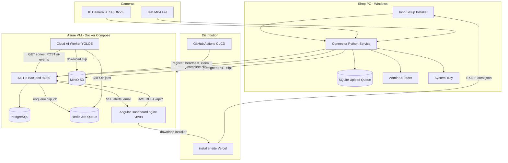
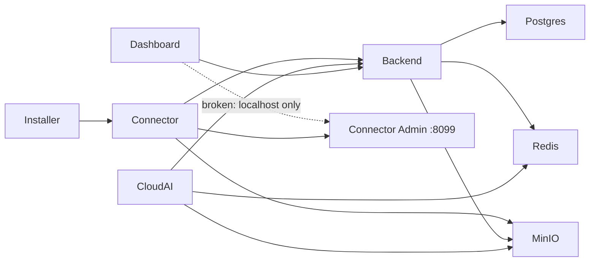

# ONEVO Phase 1A — Complete System Audit

**Repository:** [camera-phase-1](f:/tic/camera-phase%201/new%20version/camera-phase-1)  
**Product:** ONEVO Phase 1A — retail camera loss-prevention (evidence-based risk indicators, no auto-theft confirmation)  
**Audit date:** July 29, 2026  
**Production readiness score: 58 / 100** — functional MVP for controlled pilots; not ready for broad customer release without fixes below.

---

## 1. Architecture Explanation

ONEVO is a **four-tier edge-to-cloud pipeline** with a Windows edge agent and a cloud stack deployed via Docker on a single Azure VM (MVP).

### Module responsibilities

| Module | Path | Role |
|--------|------|------|
| **Installer** | [connector/installer/](connector/installer/) | Inno Setup + PyInstaller + WinSW; bakes backend URL; writes `%ProgramData%\ONEVO\Connector\config.json`; registers Windows service |
| **Connector** | [connector/app/](connector/app/) | RTSP/ONVIF capture, motion clip cutting, SQLite durable queue, S3 upload, heartbeat, local admin UI |
| **Cloud AI** | [cloud-ai/app/](cloud-ai/app/) | Redis consumer; YOLOE/YOLO26/RF-DETR detection; ByteTrack; zone mapping; Re-ID; posts events |
| **Backend** | [backend/](backend/) | JWT auth, multi-tenant RBAC, connector pairing, clip lifecycle, Risk Engine V4, alerts, SSE, email |
| **Dashboard** | [dashboard/](dashboard/) | Angular 19 SPA — onboarding, alerts, clips, zones, tuning, health, admin |
| **Infra** | [infra/mvp/](infra/mvp/), [docker-compose*.yml](docker-compose.yml) | Azure VM, ACR, nginx, prod overrides |

### Data flow (happy path)

1. Admin generates **setup code** in dashboard → connector installer claims it via `POST /api/connectors/claim`
2. Connector registers cameras → starts RTSP capture with MOG2 motion + optional HOG person filter
3. Motion triggers 10–20s H.264 clip → SQLite queue → presigned S3 PUT → `POST /api/clips/{id}/complete`
4. Backend verifies S3 object → pushes job to Redis `onevo:clip-jobs`
5. Cloud AI downloads clip → YOLOE + ByteTrack → zone events → `POST /api/ai-events`
6. Risk Engine scores (0–39 none, 40–69 analytics, 70–89 medium, 90+ high) → creates alert → SSE + optional email
7. Staff reviews alert in dashboard → `PUT /api/alerts/{id}/review`

**Important:** YOLO runs **only in cloud-ai**, not on the edge connector. Edge uses motion detection only.

---

## 2. Module Dependency Diagram

**External dependencies:** Azure ACR, Azure VM, Vercel (installer hosting), Gmail SMTP (optional), shop LAN cameras, ffmpeg (bundled in installer), NVIDIA GPU (recommended but MVP VM is CPU-only per [infra/mvp/PROVISIONED.md](infra/mvp/PROVISIONED.md)).

---

## 3. End-to-End Workflow Validation

| Step | Exists? | Status | Gap |
|------|---------|--------|-----|
| Customer installs Installer | Yes | Partial | RTSP skip broken; stale docs; no health wait |
| Connector starts (WinSW service) | Yes | Complete | Auto-restart via WinSW |
| Setup code claim | Yes | **Broken** | [wizard.py L286](connector/app/wizard.py) — undefined `key` after claim |
| Camera connects (RTSP) | Yes | Complete | Reconnect unbounded; no backend offline signal |
| RTSP stream received | Yes | Complete | TCP transport, buffer=1 |
| Frames → clip on motion | Yes | Complete | Not sent frame-by-frame to AI; clips only |
| Clip uploaded to S3 | Yes | Complete | Requires port 9000 reachable from shop |
| Cloud AI processes clip | Yes | Complete | CPU fallback; MVP VM has no GPU |
| YOLO detects event | Yes | Complete | Synthetic test.mp4 produces no retail cues (documented) |
| Backend stores event | Yes | Complete | AiEvents + RiskEvents tables |
| Dashboard updates | Yes | Partial | SSE works; no reconnect; no store filter on SSE |
| Alert generated | Yes | Partial | Silent pilot mode hides from reviewers; cross-cam alerts broken clip URL |
| User acknowledges alert | Yes | Complete | Confirm/Dismiss/FalsePositive/NeedsFollowUp |
| History updated | Yes | Complete | AlertReviews persisted |

**Missing links:** Dashboard zone snapshot → connector admin (hardcoded `localhost`); admin source management → backend (503); wizard duplicate camera creation; cross-camera theft → no SSE/email notification.

---

## 4. Broken Functionality List

### Critical (P0 — blocks core workflows)

| ID | Module | File | Description | Severity | Why it matters | Fix | Deps | Effort |
|----|--------|------|-------------|----------|----------------|-----|------|--------|
| B-01 | Connector | [connector/app/wizard.py:286](connector/app/wizard.py) | `wizard_claim` references undefined `key` after `claim_setup()` already persisted creds | Critical | `/setup` retry crashes with `NameError`; breaks recovery after failed activation | Remove duplicate cred writes or capture `key` from `claim_setup` return | provisioning.py | 1h |
| B-02 | Connector | [connector/app/wizard.py:349-370](connector/app/wizard.py) | Duplicate `create_camera` loop after `provision_sources()` + `finalize_setup()` | Critical | Duplicate cameras or 502 on wizard source save | Delete second loop; rely on `provision_sources` only | provisioning.py | 2h |
| B-03 | Connector | [connector/app/admin.py:854-868](connector/app/admin.py) | `start_admin()` never passes `BackendClient` to `build_app()` | Critical | POST/DELETE `/sources` returns 503 — add/remove cameras broken in service mode | Instantiate client from store creds; pass to `build_app` | backend_client.py | 3h |
| B-04 | Installer | [connector/installer/onevo-connector.iss:676-679](connector/installer/onevo-connector.iss) | RTSP "Skip camera setup" blocked by validation on empty field | Critical | Installers cannot skip camera config as documented | Skip validation when user chose skip | Inno Setup | 1h |

### High (P1 — broken features / bad UX)

| ID | Module | File | Description | Severity | Why | Fix | Effort |
|----|--------|------|-------------|----------|-----|-----|--------|
| B-05 | Dashboard | [dashboard/src/app/pages/setup/setup.component.ts:352](dashboard/src/app/pages/setup/setup.component.ts) | `connectorAdminHost = 'localhost'` hardcoded | High | Zone snapshot/live preview broken when dashboard is remote (production) | Resolve connector IP from backend connector record or configurable host | 1d |
| B-06 | Backend | [backend/Services/TheftOrchestrator.cs:79](backend/Services/TheftOrchestrator.cs) | Cross-camera alerts use `ClipUrl = "multi-camera-event"` | High | Alert detail shows unplayable video | Link to exit clip or composite evidence | 4h |
| B-07 | Backend | [backend/Controllers/CamerasController.cs:118-132](backend/Controllers/CamerasController.cs) | `TestStream` is ack-only stub | High | Setup "test stream" button does not validate RTSP | Proxy to connector or run ffprobe server-side | 1d |
| B-08 | Dashboard | Alerts/Clips pages | `storeId` query param ignored (only Setup reads it) | High | Admin deep-links from Get Started don't filter | Read `queryParamMap` in alerts/clips components | 2h |
| B-09 | Connector | [connector/app/workers.py:63-70](connector/app/workers.py) | Heartbeat overwrites setup `degraded_reason` | High | Admin UI loses activation error context | Merge reasons or don't overwrite setup errors | 2h |
| B-10 | Backend | [backend/Controllers/AlertsController.cs:112+](backend/Controllers/AlertsController.cs) | SSE broadcasts all alerts to all authenticated users | High | Cross-tenant data leak in multi-store deployments | Filter by `storeId` claim; per-store channels | 1d |

### Medium (P2)

| ID | Module | File | Description | Fix | Effort |
|----|--------|------|-------------|-----|--------|
| B-11 | Connector | [connector/app/main.py:186-192](connector/app/main.py) | `_preflight_rtsp()` defined but never called in native install | Wire into `_provision_native_installer` | 2h |
| B-12 | Connector | [connector/app/orchestrator.py](connector/app/orchestrator.py) | Multi-camera shares single `RuntimeState` | Per-pipeline state or namespaced metrics | 1d |
| B-13 | Dashboard | [dashboard/src/app/pages/alerts/alerts.component.ts](dashboard/src/app/pages/alerts/alerts.component.ts) | SSE no reconnect on error | Exponential backoff reconnect | 4h |
| B-14 | Installer | [connector/installer/onevo-connector.iss:222-238](connector/installer/onevo-connector.iss) | `WaitAndOpenStatus()` never called | Hook to post-install or remove dead code | 2h |
| B-15 | Connector | [connector/app/workers.py:46-49](connector/app/workers.py) | Failed uploads leave clip files on disk | Delete or quarantine after max retries | 4h |

---

## 5. Missing Implementation List

### Critical missing features

| ID | Module | Description | Why it matters | Effort |
|----|--------|-------------|----------------|--------|
| M-01 | Infra | Production GPU VM (MVP is `Standard_D2s_v5` CPU) | YOLO inference too slow at scale | 2d + Azure quota |
| M-02 | Infra | TLS for API, dashboard, MinIO | Credentials and clips traverse HTTP | 2d |
| M-03 | Backend | EF `Database.Migrate()` instead of `EnsureCreated` + ad-hoc SQL | Schema drift, no migration history in prod | 3d |
| M-04 | Security | Connector admin authentication | LAN attacker can control capture | 2d |
| M-05 | Security | Production secrets management (no default JWT/bootstrap keys) | Trivial compromise | 1d |
| M-06 | Connector | Auto-update mechanism | Manual EXE redeploy for every fix | 1w |
| M-07 | Backend | Rate limiting on auth/claim/register | Brute force setup codes | 1d |

### High priority missing features

| ID | Area | Description | Effort |
|----|------|-------------|--------|
| M-08 | Dashboard | **Analytics** page — not implemented | 1w |
| M-09 | Dashboard | **Reports** page — not implemented | 1w |
| M-10 | Dashboard | **Logs** viewer — not implemented | 3d |
| M-11 | Dashboard | **Detection History** as dedicated view (clips partially cover this) | 3d |
| M-12 | Dashboard | **AI Settings** (model backend, confidence thresholds) — only risk tuning exists | 3d |
| M-13 | Auth | Password reset, change password, user profile | 3d |
| M-14 | Auth | Sign-up / self-service onboarding | 1w |
| M-15 | Backend | Camera delete API (connector removes locally only) | 1d |
| M-16 | Connector | Remote log shipping to backend | 3d |
| M-17 | Connector | Retry failed upload jobs from admin UI | 1d |
| M-18 | Cloud AI | Cross-camera theft SSE/email notification path | 1d |
| M-19 | Backend | Horizontal scaling (in-memory SSE AlertChannel) | 1w |

### Medium / low priority

| ID | Description | Effort |
|----|-------------|--------|
| M-20 | POS integration (Phase 1B — documented deferral) | Phase 1B |
| M-21 | Staff cross-check patterns (Phase 1B) | Phase 1B |
| M-22 | RF-DETR real tracking (pseudo track ID -1 today) | 3d |
| M-23 | `camera-module/` knowledge base folder — **empty** | N/A |
| M-24 | Backup/restore strategy for Postgres + MinIO | 2d |
| M-25 | Monitoring/APM (App Insights, Prometheus) | 1w |
| M-26 | Multi-store connector fleet management dashboard | 1w |
| M-27 | False positive feedback loop → model tuning | Phase 2 |

### Frontend pages requested vs actual

| Requested page | Status | Location |
|----------------|--------|----------|
| Dashboard | Partial | Alerts + Get Started serve as hub; no unified KPI dashboard |
| Camera Management | Complete | [setup.component.ts](dashboard/src/app/pages/setup/setup.component.ts) |
| Connector Management | Partial | [health.component.ts](dashboard/src/app/pages/health/health.component.ts) + Get Started |
| Alerts | Complete | [alerts.component.ts](dashboard/src/app/pages/alerts/alerts.component.ts) |
| Detection History | Partial | [clips.component.ts](dashboard/src/app/pages/clips/clips.component.ts) |
| AI Settings | Partial | [tuning.component.ts](dashboard/src/app/pages/tuning/tuning.component.ts) — risk weights only |
| Installer Management | Partial | Admin + Get Started download |
| User Management | Partial | [admin-stores.component.ts](dashboard/src/app/pages/admin-stores/admin-stores.component.ts) — admin only |
| Analytics | **Missing** | — |
| System Health | Complete | [health.component.ts](dashboard/src/app/pages/health/health.component.ts) |
| Reports | **Missing** | — |
| Settings | Partial | Scattered across Setup/Tuning/Admin |
| Logs | **Missing** | — |

---

## 6. Security Issues

| ID | Severity | Module | File / Area | Issue | Recommended fix |
|----|----------|--------|-------------|-------|-----------------|
| S-01 | Critical | Backend | [Program.cs:63](backend/Program.cs), [.env.example](.env.example) | Default JWT signing key in repo | Require strong env var; fail startup if default in Production |
| S-02 | Critical | Backend | [DbSeeder.cs](backend/Data/DbSeeder.cs) | Default admin `admin@onevo.local` / `Admin123!` | Force password change on first login; disable seed in prod |
| S-03 | Critical | All | Bootstrap key `dev-connector-bootstrap-key` shared by connector register + cloud-ai ingest | Separate service keys with scoped permissions |
| S-04 | Critical | Connector | [admin.py](connector/app/admin.py) binds `0.0.0.0:8099` with **no auth** | LAN can pause capture, add sources, read ONVIF snapshots | Localhost-only or API token |
| S-05 | High | Backend | [ZonesController.cs](backend/Controllers/ZonesController.cs) | No tenant check on zone CRUD — any JWT with camera UUID | Add `TenantAccess.CanAccessStore` via camera join |
| S-06 | High | Backend | [AlertsController Stream](backend/Controllers/AlertsController.cs) | SSE leaks alerts across stores | Filter by tenant/store |
| S-07 | High | Infra | [PROVISIONED.md](infra/mvp/PROVISIONED.md) | MinIO port 9000 on public IP without TLS | Private endpoint or HTTPS reverse proxy |
| S-08 | High | Database | `Cameras.RtspUrl` | RTSP credentials in plaintext | Encrypt at rest or use secret vault |
| S-09 | Medium | Backend | JWT via `?access_token=` for SSE | Token in logs/referrer | Short-lived SSE tokens |
| S-10 | Medium | Backend | No rate limiting | Brute force login/setup codes | Add middleware |
| S-11 | Medium | Backend | Swagger enabled when `EnableSwagger=true` | API surface exposure | Disable in prod (prod compose does) |
| S-12 | Medium | Dashboard | JWT in localStorage, no expiry handling | XSS → token theft | httpOnly cookies + refresh; 401 interceptor |
| S-13 | Low | Connector | [baked_config.py](connector/app/baked_config.py) | Hardcoded pilot VM IP | Build-time only; document rotation |

---

## 7. Performance Issues

| ID | Area | Issue | Impact | Fix | Effort |
|----|------|-------|--------|-----|--------|
| P-01 | Infra | MVP VM is CPU-only (`Standard_D2s_v5`) | YOLO inference bottleneck, queue backlog | GPU VM + [docker-compose.gpu.yml](docker-compose.gpu.yml) | 2d |
| P-02 | Cloud AI | Sequential `brpop` single worker | Throughput limited to ~1 clip at a time | Horizontal cloud-ai replicas + job locking | 3d |
| P-03 | Cloud AI | Full clip frame processing | Latency scales with clip length | Frame sampling / keyframe-only option | 3d |
| P-04 | Connector | Per-frame MOG2 + optional HOG on edge | CPU on shop PC | Tune thresholds; disable HOG by default on weak hardware | 1d |
| P-05 | Connector | Unbounded RTSP reconnect | CPU/network churn on dead cameras | Cap retries; report offline to heartbeat | 1d |
| P-06 | Backend | `EnsureCreated` + raw SQL patches at startup | Slow/fragile boot on large DB | Proper migrations | 3d |
| P-07 | Backend | In-memory SSE | Doesn't scale; memory grows with subscribers | Redis pub/sub or SignalR backplane | 1w |
| P-08 | Network | Clips upload over HTTP to public MinIO:9000 | Large bandwidth; no CDN | TLS + dedicated upload endpoint | 2d |
| P-09 | Database | Alerts list capped at 500, no pagination API tuning | Slow as data grows | Cursor pagination, indexes | 2d |

---

## 8. Technical Debt

- **Schema management:** EF migration exists ([20260718070711_AddReIDEmbedding.cs](backend/Migrations/20260718070711_AddReIDEmbedding.cs)) but runtime uses [DbSeeder.EnsureCreatedAsync](backend/Data/DbSeeder.cs) + manual SQL patches
- **README inaccuracies:** Claims ".NET 10" but targets `net8.0`; backend port 8080 in README vs 8081 in compose
- **Duplicate activation logic** in [connector/app/main.py](connector/app/main.py) (overlapping provisioning paths)
- **Dead code:** `_preflight_rtsp`, `WaitAndOpenStatus()`, stale INSTALL.md v1.1.0 vs code v1.1.5
- **Demo data in production path:** DbSeeder creates Demo Store with `file://samples/test.mp4`
- **Single shared service key** for multiple trust boundaries
- **No structured logging** in connector (print + 200-line deque)
- **Build deps not in repo:** ffmpeg.exe, WinSW-x64.exe manual placement
- **Empty `camera-module/`** referenced in README as design knowledge base

---

## 9. UI/UX Improvements

| Priority | Issue | Recommendation |
|----------|-------|----------------|
| High | Remote zone snapshot broken | Show connector-reachable URL or "open on shop PC" guidance |
| High | No global 401 redirect | Interceptor → login on token expiry |
| High | SSE "Offline" with no retry | Auto-reconnect + user notification |
| Medium | Reviewer role same nav as Manager | Role-specific landing pages |
| Medium | Tuning page save 403 for Reviewer | Hide save button for unauthorized roles |
| Medium | No loading/error states on some admin actions | Consistent skeleton + toast pattern (Alerts already good) |
| Medium | Dev credentials shown on login page | Remove in production builds |
| Low | Wildcard route → welcome not login | Consider `/app/*` unknown → 404 in app shell |
| Low | Mobile responsiveness | Zone canvas editor likely poor on tablet |

---

## 10. AI Pipeline Improvements

**Current state (solid):** Pluggable backends ([detector.py](cloud-ai/app/detector.py)), ByteTrack, 11 Phase 1A event types ([events.py](cloud-ai/app/events.py)), Re-ID embeddings ([reid.py](cloud-ai/app/reid.py)), dead-letter queue ([main.py](cloud-ai/app/main.py)).

| Improvement | Priority | Details |
|-------------|----------|---------|
| GPU production deployment | Critical | `CLOUD_AI_DEVICE=cuda` useless without GPU VM |
| Confidence threshold tuning UI | High | Env-only today (`CLOUD_AI_*`) |
| False positive handling | High | Review workflow exists; no feedback to model/thresholds |
| Batch processing | Medium | One clip at a time |
| RF-DETR tracking | Medium | Track ID always -1 |
| Model hot-reload | Low | Requires worker restart |
| Evaluation harness | Low | [cloud-ai/eval/](cloud-ai/eval/) exists but not wired to CI |
| Phase 1B POS proxies | Future | Documented in README and events.py comments |

---

## 11. Connector Improvements

| Area | Current | Needed |
|------|---------|--------|
| Camera discovery | ONVIF in admin only | Add to installer wizard |
| Offline mode | Implicit via SQLite queue | Explicit UI indicator + queue depth alerts |
| Config sync | Poll backend cameras every 10s | Conflict resolution when dashboard edits RTSP |
| Log upload | None | Ship to backend or S3 |
| Version management | Hardcoded 1.1.5 | Check `latest.json` from Vercel |
| Memory/CPU monitoring | Disk % in heartbeat only | CPU/RAM metrics |
| Encryption | HTTPS to backend; local SQLite unencrypted | Encrypt creds at rest |
| Camera removal | Local only | Call backend delete |

---

## 12. Installer Improvements

| Issue | Fix |
|-------|-----|
| RTSP skip broken (B-04) | Fix Inno validation |
| No post-install health wait | Call `WaitAndOpenStatus` or document actual behavior |
| Stale INSTALL.md (v1.1.0) | Sync to 1.1.5 |
| Manual ffmpeg/WinSW | Document clearly; consider submodule or download script |
| Uninstall wipes all ProgramData | Offer "keep configuration" option |
| No downgrade path | Document; consider migration backup |
| Baked backend URL rotation | Rebuild required — document update process |

---

## 13. Backend Improvements

**Implemented well:** 40+ REST endpoints, BCrypt connector keys, atomic setup code claim, tenant scoping on stores/cameras/alerts/clips, presigned URLs, Risk Engine V4.

**Needed:**
- Fix zones + SSE authorization (S-05, S-06)
- Replace `EnsureCreated` with migrations (M-03)
- Implement real `TestStream` (B-07)
- Input validation on DTOs (`[Required]`, polygon schema)
- Separate cloud-ai service key from connector bootstrap key
- Cross-camera alert notifications + valid clip URL (B-06, M-18)
- Pagination on list endpoints
- Health endpoints for cloud-ai worker (currently only pipeline queue depth)

---

## 14. Frontend Improvements

**Implemented well:** 12 routes, lazy loading, auth guards, SSE live alerts, zone canvas editor, onboarding checklist, installer download.

**Needed:**
- Fix localhost connector admin integration (B-05)
- Query param deep linking (B-08)
- SSE reconnect (B-13)
- Missing pages: Analytics, Reports, Logs (M-08–M-10)
- Auth: password reset, token expiry (M-13)
- `ng serve` API proxy config for local dev without Docker
- Production build: strip dev login hints

---

## 15. Production Readiness Score Breakdown

| Category | Score | Notes |
|----------|-------|-------|
| Core pipeline E2E | 85/100 | Works with real footage; synthetic test validates plumbing only |
| Connector reliability | 55/100 | Critical wizard/admin bugs; no auto-update |
| AI accuracy/ops | 70/100 | Good architecture; CPU MVP limits throughput |
| Backend API | 75/100 | Feature-complete; auth gaps on zones/SSE |
| Frontend UX | 65/100 | Main flows work; missing pages; remote snapshot broken |
| Security | 35/100 | Default secrets, unauthenticated admin, HTTP MinIO |
| Deployment/ops | 50/100 | CI/CD exists; no GPU, no TLS, ad-hoc schema, no monitoring |
| Documentation | 60/100 | Good README; stale installer docs, port mismatches |
| Testing | 45/100 | Connector unit tests; no E2E integration tests |
| Scalability | 40/100 | Single VM, in-memory SSE, single cloud-ai worker |

### **Overall: 58 / 100**

**Verdict:** Suitable for **controlled pilot** with manual ops support. **Not ready** for unattended multi-store customer rollout until P0 bugs and security items are resolved.

---

## 16. Prioritized Roadmap

### Phase 0 — Release blockers (1–2 weeks, high impact)

| Task | Issues | Effort | Impact |
|------|--------|--------|--------|
| Fix wizard claim `key` bug | B-01 | 1h | Unblocks setup recovery |
| Fix duplicate camera creation | B-02 | 2h | Prevents bad DB state |
| Pass BackendClient to admin | B-03 | 3h | Unblocks camera management |
| Fix installer RTSP skip | B-04 | 1h | Unblocks headless install |
| Rotate all default secrets | S-01–S-03 | 1d | Prevents trivial compromise |
| Secure connector admin (localhost or token) | S-04 | 2d | Prevents LAN takeover |
| Fix zones + SSE tenant filtering | S-05, S-06, B-10 | 2d | Multi-store safety |
| Fix remote zone snapshot | B-05 | 1d | Production zone setup |

### Phase 1 — Production hardening (2–4 weeks)

| Task | Issues | Effort | Impact |
|------|--------|--------|--------|
| TLS + domain setup (API, app, MinIO) | S-07, M-02 | 2d | Security + compliance |
| GPU VM provisioning | P-01, M-01 | 2d | AI throughput |
| EF migrations replace EnsureCreated | M-03, P-06 | 3d | Schema reliability |
| Rate limiting + input validation | S-10 | 2d | Abuse prevention |
| SSE reconnect + 401 handling | B-13, S-12 | 1d | UX + security |
| Cross-camera alert fix + notifications | B-06, M-18 | 1d | Feature completeness |
| Failed upload cleanup + heartbeat fix | B-09, B-15 | 1d | Edge reliability |

### Phase 2 — Customer feature completeness (4–8 weeks)

| Task | Effort | Impact |
|------|--------|--------|
| Analytics + Reports pages | 2w | Customer visibility |
| Logs viewer + remote log shipping | 1w | Supportability |
| Password reset + user profile | 3d | Enterprise auth |
| Connector auto-update | 1w | Ops at scale |
| AI settings UI (thresholds, backend) | 3d | Tunability without redeploy |
| Monitoring (App Insights / Prometheus) | 1w | Observability |
| E2E integration test suite | 1w | Regression safety |

### Phase 3 — Scale & Phase 1B (future)

- Horizontal cloud-ai workers
- Redis-backed SSE / SignalR
- POS integration
- Model feedback loop from false positive reviews
- Multi-region deployment

---

## 17. Integration Audit Summary

| Integration | Auth | Retries | Error handling | Health | Offline recovery | Grade |
|-------------|------|---------|----------------|--------|------------------|-------|
| Installer → Connector | Config file | WinSW auto-restart | Partial | `/health` exists | WinSW restart | B |
| Connector → Cameras | RTSP creds in URL | Unbounded reconnect | Good logging | Frame read failures | Reconnect loop | B- |
| Connector → Backend | API key header | Upload exp backoff | SQLite queue | Heartbeat 10s | Queue persists | A- |
| Connector → AI | Indirect via S3+Redis | N/A | Upload retry | N/A | Clips buffered | A- |
| Backend → Database | Connection string | EF retry limited | EnsureCreated patches | `/api/health` | Postgres persistence | C+ |
| Backend → Frontend | JWT Bearer | HTTP client default | Partial | Health page | Manual re-login | B |
| Frontend → Connector admin | **None** | N/A | Broken remote | N/A | N/A | F |
| Cloud AI → Backend | Service key | 3x job retry + DLQ | Good | Pipeline health only | DLQ inspection | B+ |

---

## 18. What Works Well (do not regress)

- End-to-end clip pipeline architecture is sound and documented
- Durable SQLite upload queue with exponential backoff
- Atomic setup code pairing (BCrypt hashed, 30-min expiry, single-use)
- Risk Engine V4 with evidence-only language guardrails
- Pluggable YOLO backends with evaluation harness scaffold
- Angular dashboard covers core staff workflows (alerts, review, zones, tuning)
- GitHub Actions CI + Azure deploy pipeline with Windows installer artifact
- Connector ONVIF discovery and multi-camera orchestrator
- Presigned S3 uploads (clips never pass through backend body)

---

## Recommended immediate actions before any customer release

1. Fix all four **P0 connector/installer bugs** (B-01 through B-04) — estimated **1 day**
2. Rotate secrets and disable default admin in production — **1 day**
3. Lock connector admin to localhost or add auth — **2 days**
4. Fix SSE/zones tenant leaks — **2 days**
5. Enable TLS and move MinIO off public HTTP — **2 days**
6. Provision GPU VM or set expectations that AI processing will lag — **2 days**

**Minimum viable pilot timeline:** ~2 weeks after P0 + security fixes, with ops runbook ([docs/PILOT_ONBOARDING.md](docs/PILOT_ONBOARDING.md)) and manual support.
